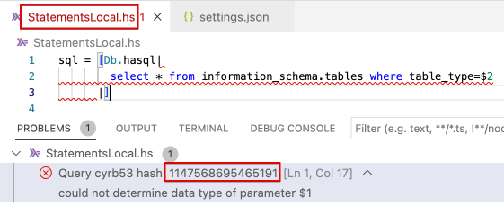

# VSCode PostgreSQL Hasql

The extension is used for checking query syntax and entities over existing database.
It helps to determine errors at the most early stage of development without
the need to run extensive CI tools and tests to verify queries.
The extension is not intendent to use as a replacement for tests and CI tools, its
purpose is only to collect mistakes while you are writting the query.

## Features

Describe specific features of your extension including screenshots of your extension in action. Image paths are relative to this README file.

For example if there is an image subfolder under your extension project workspace:

\!\[feature X\]\(images/feature-x.png\)

> Tip: Many popular extensions utilize animations. This is an excellent way to show off your extension! We recommend short, focused animations that are easy to follow.

## Requirements

To compile the extension you might need to have locally postgresql cli tools installed.

## Extension Settings

This extension contributes the following settings:

* `psql_hasql.dbHost`: PostgreSQL host name (default `localhost`). Restart editor to apply changes.
* `psql_hasql.dbPort`: PostgreSQL port number (default `5432`). Restart editor to apply changes.
* `psql_hasql.dbUser`: PostgreSQL user name (default `postgres`). Restart editor to apply changes.
* `psql_hasql.dbPassword`: PostgreSQL password (default `postgres`). Restart editor to apply changes.
* `psql_hasql.dbName`: PostgreSQL database name which is used for query live validations (**required**). Restart editor to apply changes.
* `psql_hasql.typeCasts`: PostgreSQL type annotations (default `{}`). Change value and it will be applied to extension without editor restart. Details read below.

## Manual Type Annotations

Some complex queries require manual type anntations. It would be nice to extract actual types from Haskell code around `hasql` expressions but for now let's use such dummy approach. Good news are rare queries need them.

For instance, you have a query where some positioned arguments are missed. Like that one:

```haskell
sql = [Db.hasql|
  select * from information_schema.tables 
  where table_type=$2
|]
```

PostgreSQL will raise an error about not determined types, and the error will be displayed like that:



To successfuly apply manual type annotation you should take a look at `filename` and `cybr53 hash` value. They are in red rects at the figure above.

Then you need add this information to the plugin config:

```json
"psql_hasql.typeCasts": {
  ...,
  "StatementsLocal.hs": {
    ...,
    "1147568695465191": {
       "1": "boolean"
    }
  },
}
```

You should use file Relative Path to the opened VSCode workspace and appropriate positioned argument number.

## Known Issues

* Sometimes you need restart the editor one more time if your postgres connection had been interrupted. It does not support automatic reconnects at the time.

## Release Notes

Users appreciate release notes as you update your extension.

### 0.0.1

Initial release.
